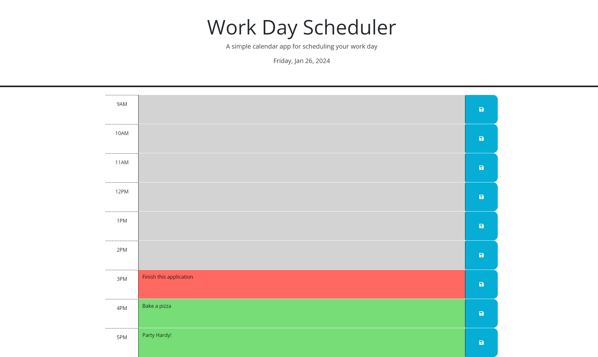

# Work-Day-Scheduler

## Description

An application that allows the user to schedule their day and be informed if events are in the past, present, or future.

## Table of Contents

- [Introduction](#introduction)
- [Problem](#problem)
- [Solution](#solution)

## Introduction

The client has asked for a daily planner for a 9-5 workday.

## Problem

The client would like to be able to see a schedule of their day and make events, or "to-dos". The client would also like some color coding to quickly see what the current hour is and which hours are in the past and which are upcoming.

## Solution

I created a daily planner which shows the current hour highlighted in one color, then past hours in a second color, and future hours in a third color. The planner also allows for saving things as events in each hour timeslot.

[Link to the deployed application](https://ktetsuyama.github.io/Work-Day-Scheduler/)

## Credits

I collaborated with John Young to get started. I worked with a tutor to further understand jQuery in general, and I used the jQuery documentation. I also used phind.com to help debug my code.

Tutorials used:

[jQuery Docuementation](https://api.jquery.com/)

## License

MIT License
